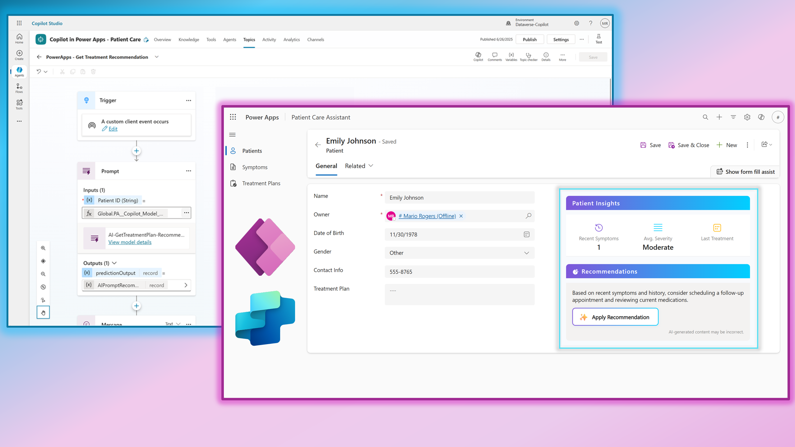
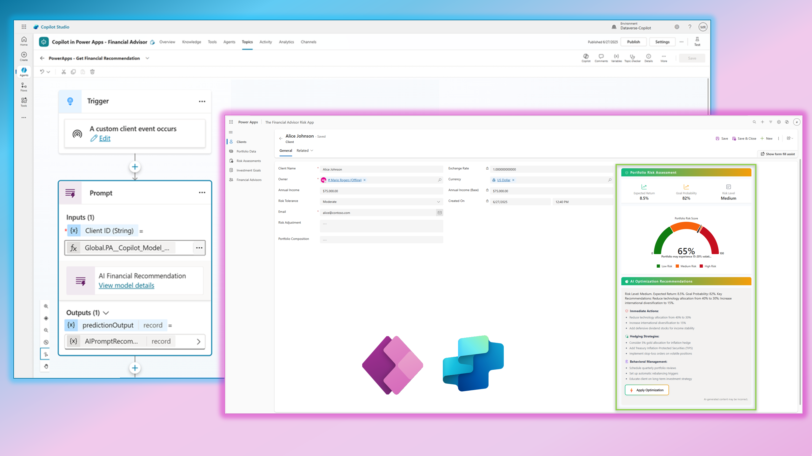
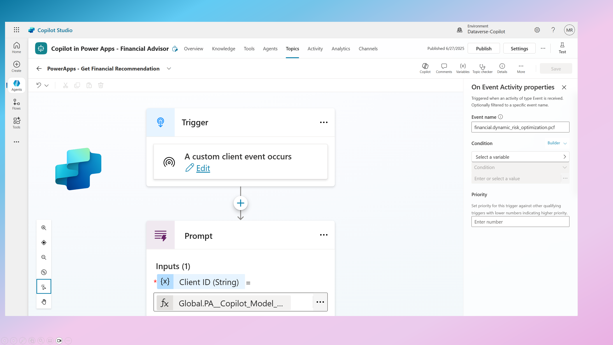

# PowerApps + Copilot Studio: Smart Forms with Agent APIs

Reference implementation demonstrating how to integrate **Microsoft Copilot Studio** with **PowerApps** using the new **Agent APIs** in **PCF controls**.

## What This Shows

Two working examples of PCF controls that call Copilot Studio agents using `context.copilot.executeEvent`:

- 🏥 **Patient Care Assistant** - Healthcare recommendations  
- 💰 **Financial Advisor Assistant** - Investment risk analysis

### Patient Care Assistant Demo


### Financial Advisor Assistant Demo


## Core Implementation

```typescript
// Call Copilot Studio agent from PCF
const result = await context.copilot.executeEvent(
  "healthcare.patient_care_optimization.pcf", 
  { id: patientId, symptoms }
);
```

Each PCF includes:
- **React + Fluent UI** components with loading states
- **Agent API service layer** with error handling
- **Structured response parsing** from Copilot Studio
- **Bidirectional data binding** (input fields → AI → output fields)

## How to Use

### 1. Setup Copilot Studio
Create topics with event triggers matching the PCF calls:
- `financial.dynamic_risk_optimization.pcf`
- `healthcare.patient_care_optimization.pcf`



**Note:** Ensure you have sufficient AI Builder Credits for the custom prompts to work in the Agent.

### 2. Deploy PCF Controls
```powershell
npm install && npm run build
pac pcf push --publisher-prefix yourprefix
```

### 3. Add to Model-Driven Apps Forms
- Add the PCF controls to your forms
- Bind input properties to Dataverse fields
- Bind output properties to fields that should receive AI recommendations

---
*Reference implementation showcasing Agent APIs in PCF for next-generation PowerApps with Copilot Studio integration.*
